<div align="center">


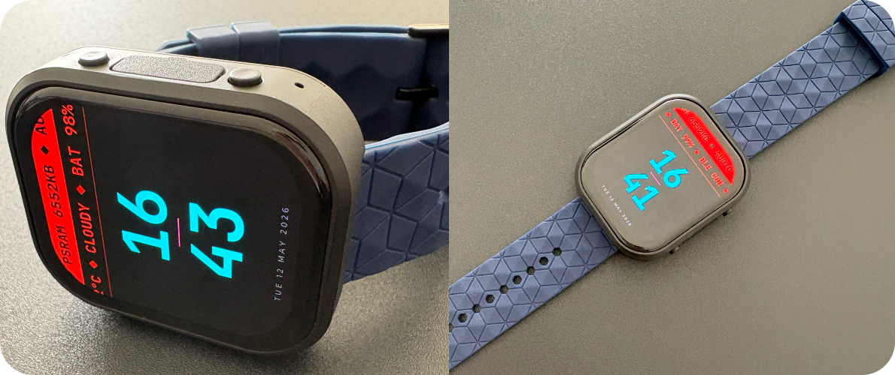

</div>

A feature-rich smartwatch firmware for the **Waveshare ESP32-S3 Touch AMOLED 2.06"** board. Combines BLE phone connectivity, media playback, notifications, productivity apps, GB emulator. 10+ hrs of battery life when used as a watch (auto light sleep, wrist raise to wake, BLE notifications active).

---

## Features

### Watchfaces

Four distinct watchfaces, swipeable from the main screen. Each has its own aesthetic, notification integration, and interactive elements.

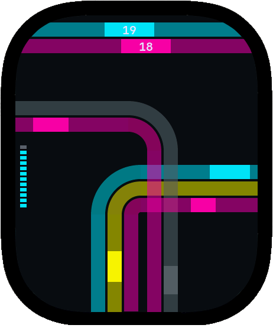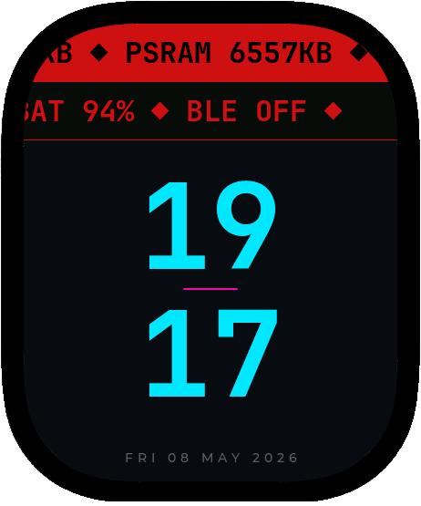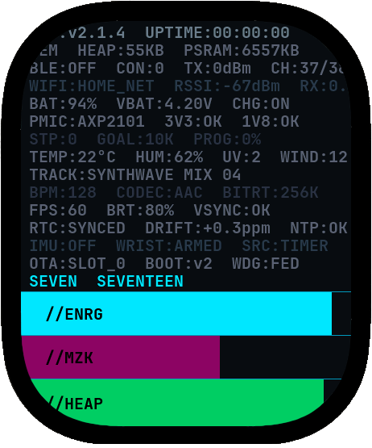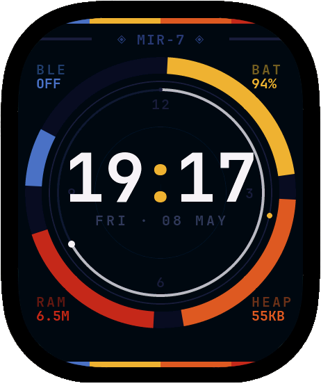

---

#### Face A — Circuit
PCB-trace aesthetic with animated signal pulses.

- Five PCB trace paths (two bundles) with traveling shine animations
- **12-cell pixel battery gauge**
- **Guitar Hero mini-game** — tap the lane buttons to hit falling segments; score tracked per round

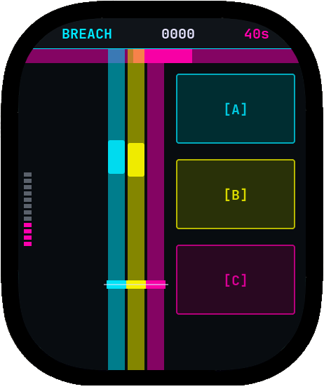

---

#### Face B — Headline
Bold headline-style layout with scrolling data rows.

- Two news-banner scroller rows showing live system data (heap/PSRAM/audio, battery/BLE)
- Notification mode switches banner rows to show app name and notification title

---

#### Face C — Data
Dense terminal/HUD layout.

- 15 static text rows populated with live telemetry and system data
- **Time-as-words** row (e.g. "TWENTY THREE FORTY")
- Three fill bars: **ENRG** (battery), **MZK** (music playback elapsed), **DIST** (heap free)
- Notification content embedded directly into rows (app, title, body)

---

#### Face D — Horizon

- **Tap cycle** — single tap (on the top "Mir -7" label) cycles through four states: Clock → Moon phase → Solar orrery → Night Sky → Clock
- **Clock state** — analog-style ring dial with live telemetry arcs (battery %, heap free, PSRAM free, BLE status), seconds ring
- **Moon state** — moon phase disc with daylight arc and sunrise/sunset time badges
- **Solar state** — full orrery with all 9 planets orbiting the sun
- **Night Sky** - Visible constellations and stars
- **Notification panel** — slides up from the bottom with message content

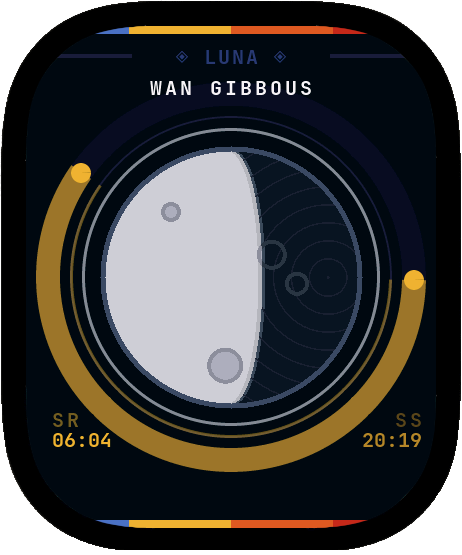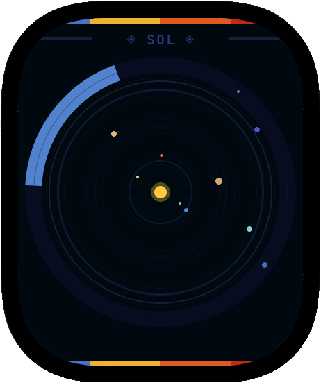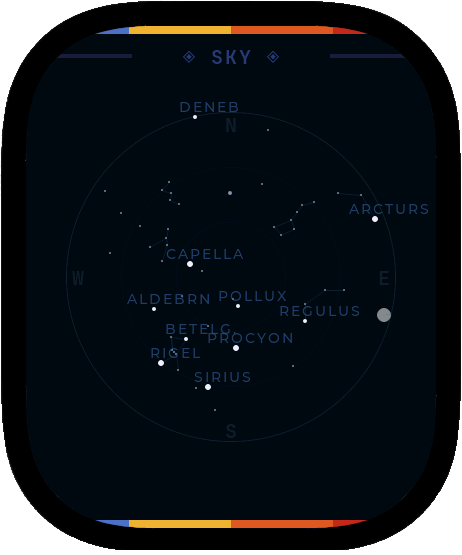

---

## Themes

Watchface A,B and C and every UI screen share a single color system. Four variants are available and switchable from Settings

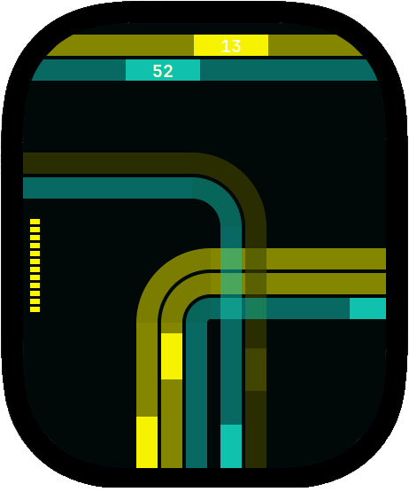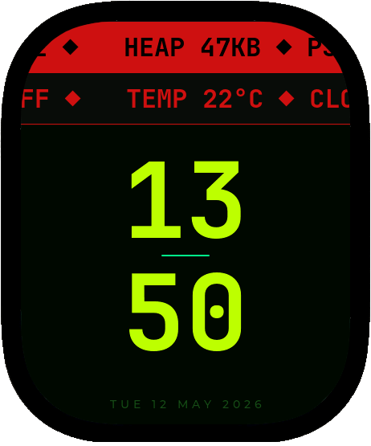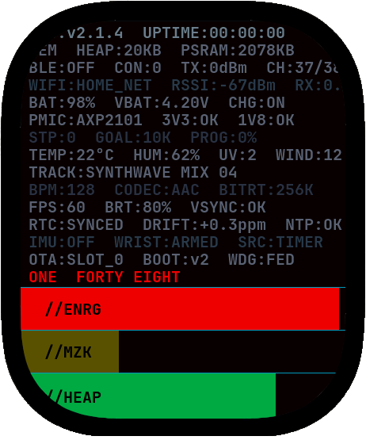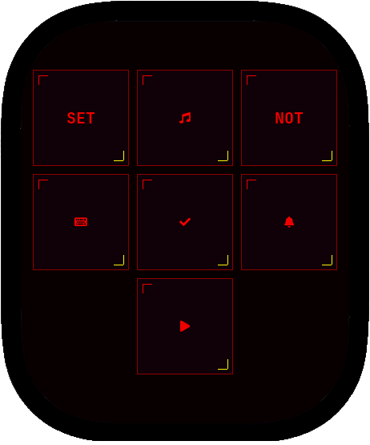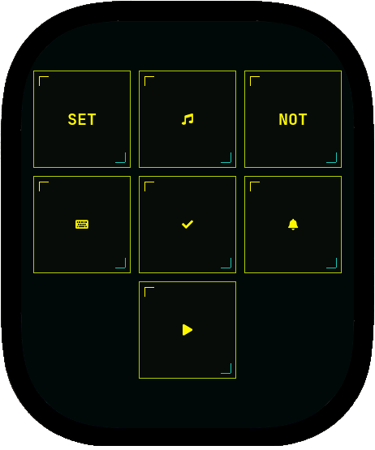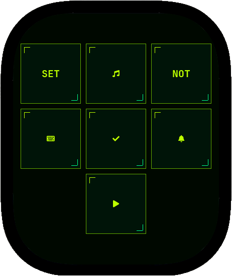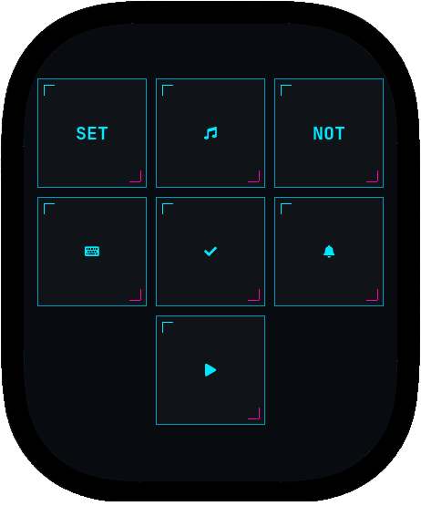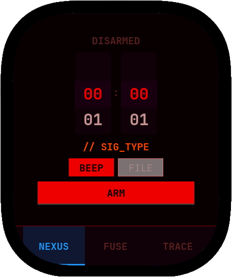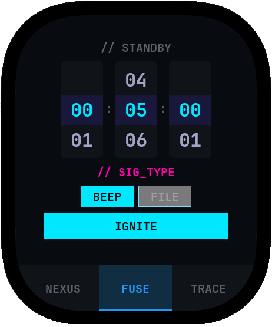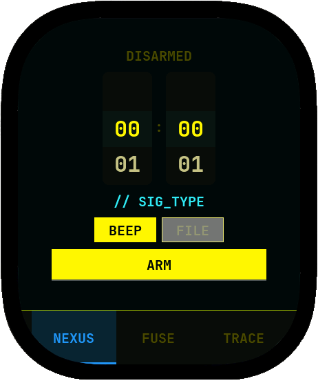

---

### iPhone Notifications (ANCS)
- Receive notifications from iPhone over BLE
- Browse a ring buffer of the last 20 notifications
- **Per-app muting** — silence specific apps
- Metadata displayed: app name, title, body, timestamp

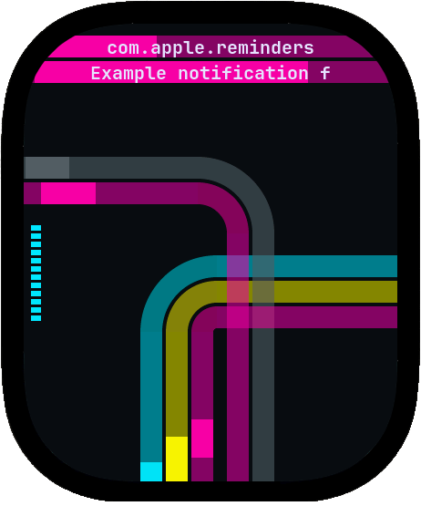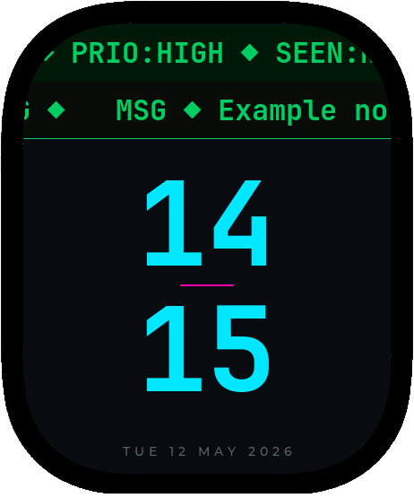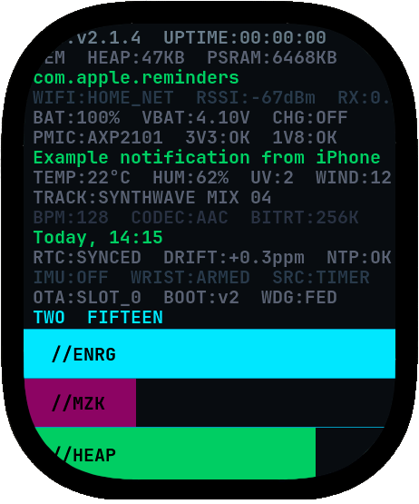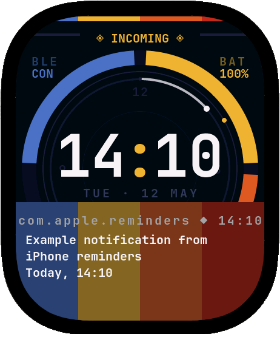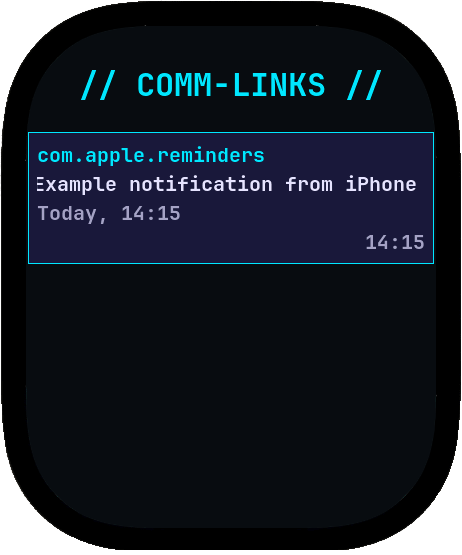

### Music Player
- Plays **MP3 and WAV files** from microSD card
- ID3v1 tag display (artist, album, title)
- Playlist scanning — up to 200 files, alphabetically sorted
- Transport controls: play / pause / next / previous / stop
- **Shuffle** and **repeat** modes (off / one / all)

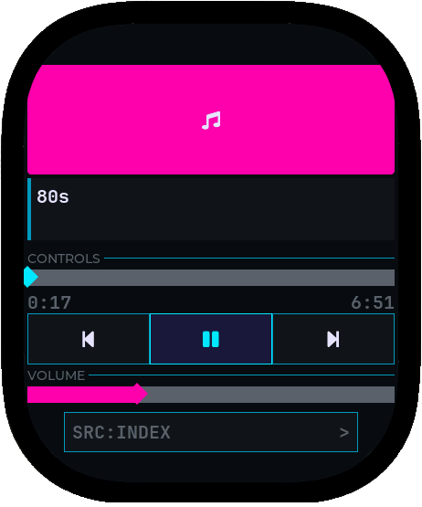

### iPhone Media Remote (AMS)
- Control iPhone music playback from the watch over BLE
- Fetch and display current track metadata (artist, album, title)
- Commands: play, pause, toggle, next, previous, volume up/down

### PC Remote (BLE HID)
Use the watch as a wireless trackpad and keyboard for any paired PC, Mac, or tablet.

- **Touchpad mode** — drag a finger across the screen for relative mouse movement; tap to left-click
- **Keyboard mode** — full on-screen keyboard (compact and full layout) sends BLE HID keystrokes directly to the connected device

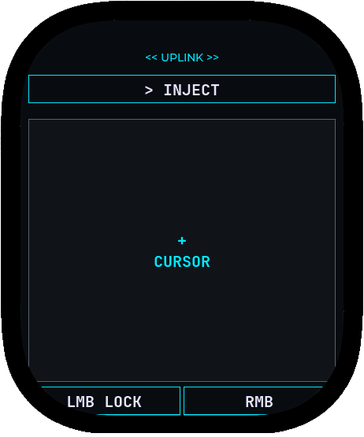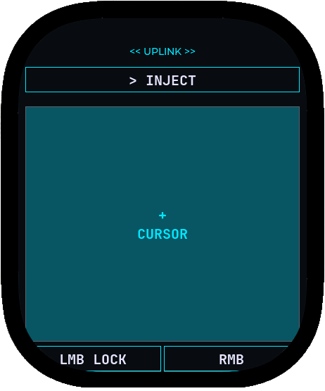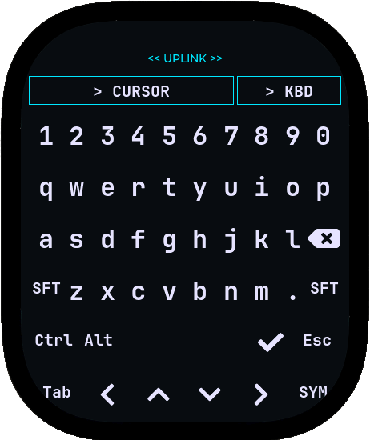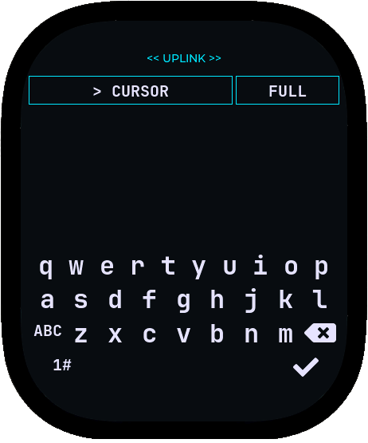

### Alarms & Timers
- **Alarms (NEXUS)** — set time-of-day alarms; fires with a beep tone or a custom audio file from SD card
- **Timers (FUSE)** — countdown timers with audio alert on completion
- **Stopwatch (TRACE)** — lap timing

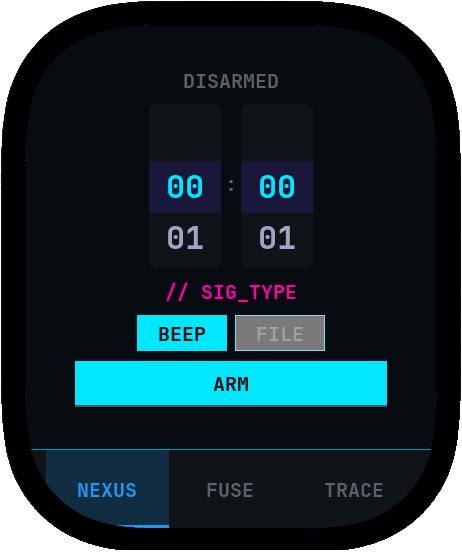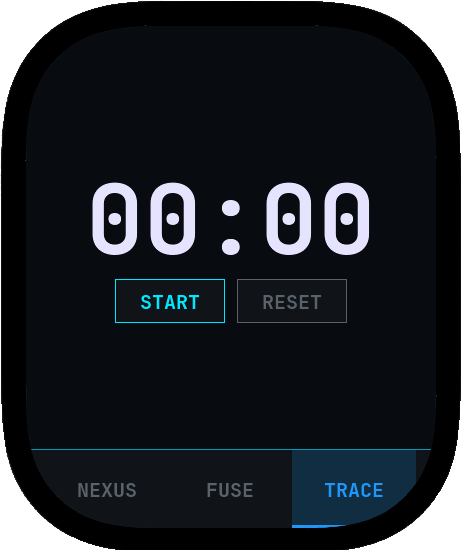

### Todo List
- Add, complete, and delete tasks
- Holds up to 500 items
- Persists to `/sdcard/todos.json` — survives reboots
- **iPhone Reminders integration** — incoming iPhone Reminders notifications are automatically parsed and added as todo items

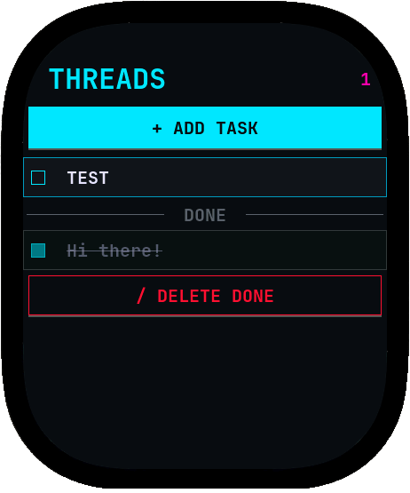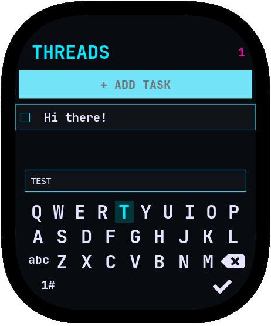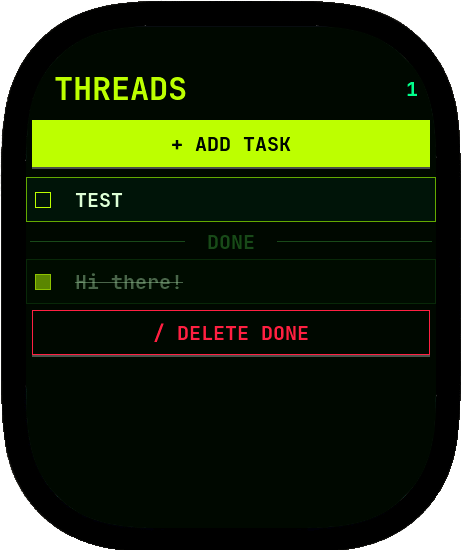

### Game Boy Emulator
- Play `.GB` and `.GBC` ROM files from microSD
- 2x scale mode (320×288)
- Two control modes: semi-transparent D-pad overlay, or swipe-gesture controls (swipe = D-pad, tap zones = A/B at the bottom, start select at the top)
- Save state support for cart RAM

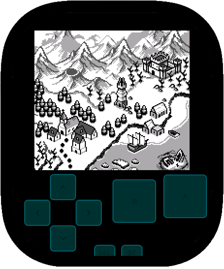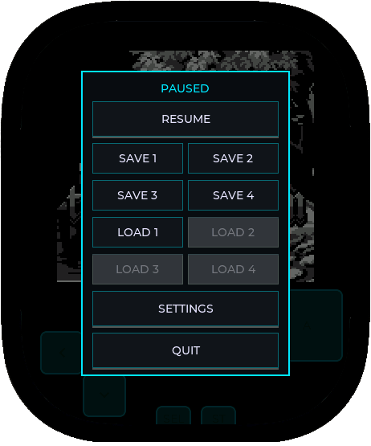

### Others
- **BLE Current Time Service** — sync time directly from paired phone
- **Wrist raise to wake** — IMU gesture detection wakes the display when the watch is raised to viewing position
- **Light sleep** — auto light sleep achieves 10+ hours battery life with BLE paired and notifications active


---

## Hardware

| | |
|---|---|
| **Board** | Waveshare ESP32-S3 Touch AMOLED 2.06" |
| **MCU** | ESP32-S3 dual-core @ 240 MHz, 8 MB PSRAM |
| **Display** | CO5300 AMOLED, 410×502 px, 2.06" |
| **Touch** | FT5x06 capacitive touch panel |
| **IMU** | QMI8658 (accelerometer, gyroscope, pedometer) |
| **RTC** | PCF85063A (battery-backed) |
| **Audio** | ES8311 codec + ES7210 mic (I2S) |
| **Power** | AXP2101 PMIC (fuel gauge, charging control) |
| **Storage** | microSD via SPI |
| **Wireless** | BLE 5.0 (NimBLE stack) + WiFi 802.11 b/g/n (wifi not initialized) ||


---


## SD Card Layout

```
/sdcard/
  todos.json       — Todo list storage
  alarm.json       — Alarm configuration
  firmware.bin     — OTA update target (optional)
  music/           — MP3/WAV audio files
  roms/            — GB ROM files (.gb, .gbc)
```

---

## Third-Party Components

This project uses the following open-source libraries.

| Library | License | Purpose |
|---|---|---|
| [ESP-IDF](https://github.com/espressif/esp-idf) | Apache 2.0 | Core framework, FreeRTOS, WiFi, NVS, SNTP |
| [NimBLE](https://github.com/apache/mynewt-nimble) | Apache 2.0 | BLE stack (ANCS, AMS, CTS, bonding) |
| [LVGL](https://github.com/lvgl/lvgl) | MIT | Graphics library, touch input, UI widgets |
| [esp-idf-lib / esp_codec_dev](https://github.com/espressif/esp-codec-dev) | Apache 2.0 | ES8311 audio codec + ES7210 mic driver |
| [esp_io_expander](https://github.com/espressif/esp-idf-lib) | Apache 2.0 | I/O expander HAL |
| [esp_lcd_co5300](https://github.com/espressif/esp-bsp) | Apache 2.0 | CO5300 AMOLED display driver |
| [esp_lcd_panel_io_additions](https://github.com/espressif/esp-bsp) | Apache 2.0 | LCD panel I/O abstraction |
| [esp_lcd_touch_ft5x06](https://github.com/espressif/esp-bsp) | Apache 2.0 | FT5x06 capacitive touch driver |
| [espressif__cmake_utilities](https://github.com/espressif/esp-cmake-utilities) | Apache 2.0 | Build system utilities |
| [waveshare__qmi8658](https://www.waveshare.com) | Apache 2.0 | QMI8658 IMU driver |
| [waveshare__pcf85063a](https://www.waveshare.com) | Apache 2.0 | PCF85063A RTC driver |
| [peanut_gb](https://github.com/deltabeard/Peanut-GB) | MIT | Game Boy / Game Boy Color emulator core |
| [minigb_apu](https://github.com/deltabeard/minigb_apu) | MIT | Game Boy APU (audio) emulator |
| [minimp3](https://github.com/lieff/minimp3) | CC0 (Public Domain) | MP3 decoder |
| [XPowersLib](https://github.com/lewisxhe/XPowersLib) | MIT | AXP2101 PMIC driver |

---

## Release

Not planned yet
